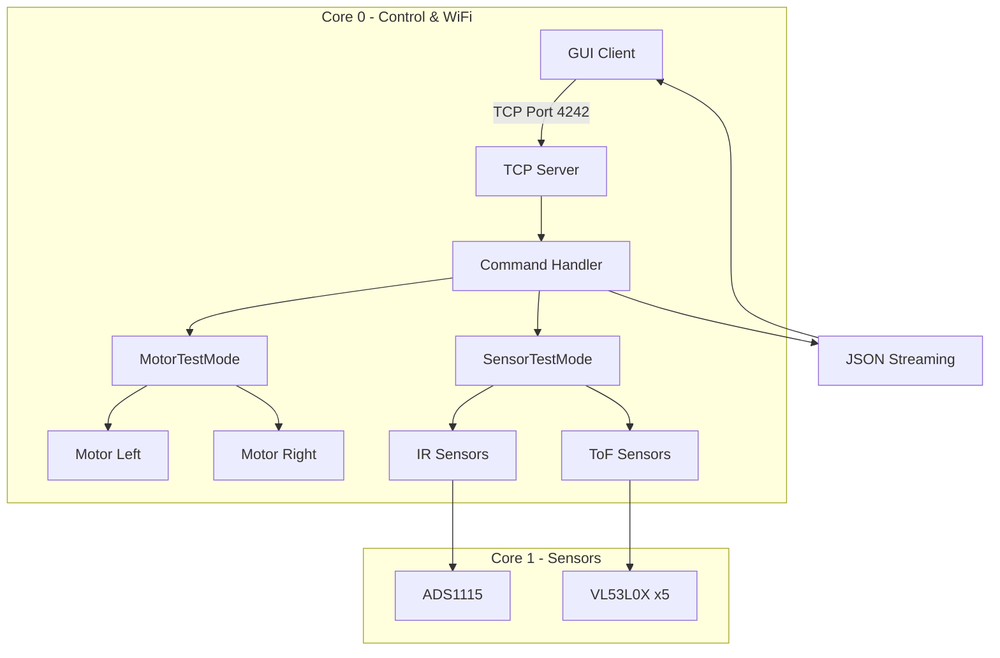

# BottleSumo Test Mode Guide

## Overview
This guide documents the **modular test framework** integrated into the BottleSumo LEGACY firmware (`BottleSumo_RealTime_Streaming.ino`). The test mode enables GUI-based PWM motor control and comprehensive sensor testing/calibration via TCP commands.

**Design Philosophy:**
- **Modular:** All test logic in separate header files for easy extraction
- **Safe:** Built-in timeout, emergency stop, PWM clamping
- **Portable:** Header-only modules can be copy-pasted to TimeSliced version

---

## Architecture



**Module Mapping:**
- `TestModeCommon.h` = Shared state, enums, utilities (line ~150)
- `MotorTestMode.h` = Motor test namespace with TCP handlers (line ~130)
- `SensorTestMode.h` = Sensor test/calibration namespace (line ~260)
- `Motor.h/cpp` = RP2040 PWM motor driver (pre-existing)
- Main .ino lines 951+ = TCP command integration
- Main .ino lines 1736+ = Loop execution logic

---

## Test Modes

| Mode | Purpose | Motors Active | Sensors Active | Calibration |
|------|---------|---------------|----------------|-------------|
| **AUTO** | Autonomous operation | ✅ (autonomous) | ✅ | ❌ |
| **TEST_MOTOR** | GUI PWM control | ✅ (manual) | ✅ | ❌ |
| **TEST_SENSOR** | Individual sensor testing | ❌ | ✅ (filtered) | ❌ |
| **CALIBRATE_IR** | IR min/max recording | ❌ | ✅ (IR only) | ✅ |
| **CALIBRATE_TOF** | ToF range calibration | ❌ | ✅ (ToF only) | ✅ |

---

## TCP Command Reference

### Connection
```bash
# Connect to robot WiFi AP
SSID: BottleSumo_Robot
Password: (check firmware)

# Connect TCP client
nc <robot_ip> 4242
# or
telnet <robot_ip> 4242
```

---

### Mode Control

#### SET_MODE
Switch between test modes.

**Syntax:**
```
SET_MODE <mode_name>
```

**Examples:**
```bash
SET_MODE AUTO           # Switch to autonomous mode
SET_MODE TEST_MOTOR     # Enable motor testing
SET_MODE TEST_SENSOR    # Enable sensor testing
SET_MODE CALIBRATE_IR   # Start IR calibration (manual)
SET_MODE CALIBRATE_TOF  # Start ToF calibration (manual)
```

**Response:**
```json
{"ack":"set_mode","mode":"TEST_MOTOR","status":"ok"}
```

---

### Motor Commands

#### TEST_MOTOR
Set motor PWM duty cycles (-100 to +100).

**Syntax:**
```
TEST_MOTOR <left_pwm> <right_pwm>
```

**Examples:**
```bash
TEST_MOTOR 50 50        # Both motors forward at 50%
TEST_MOTOR -30 -30      # Both motors reverse at 30%
TEST_MOTOR 75 -75       # Spin clockwise (left fwd, right rev)
TEST_MOTOR 0 100        # Only right motor forward at 100%
```

**Response:**
```json
{
  "ack":"test_motor",
  "left_pwm":50.00,
  "right_pwm":50.00,
  "timeout_s":5,
  "status":"ok"
}
```

**Safety:**
- Auto-stops after 5 seconds (configurable timeout)
- PWM clamped to ±100%
- Only works in TEST_MOTOR mode

---

#### STOP_MOTOR
Emergency stop all motors.

**Syntax:**
```
STOP_MOTOR
```

**Response:**
```json
{"ack":"stop_motor","left_pwm":0.00,"right_pwm":0.00,"status":"ok"}
```

---

#### GET_MOTOR
Query current motor state.

**Syntax:**
```
GET_MOTOR
```

**Response:**
```json
{
  "motor_state":{
    "left_pwm":50.00,
    "right_pwm":-30.00,
    "timeout_ms":3245,
    "is_active":true
  }
}
```

---

### Sensor Commands

#### TEST_SENSOR
Test individual sensor(s).

**Syntax:**
```
TEST_SENSOR <type> <id>
TEST_SENSOR ALL         # Test all sensors
```

**Examples:**
```bash
TEST_SENSOR IR 0        # Test IR sensor 0
TEST_SENSOR IR 3        # Test IR sensor 3
TEST_SENSOR TOF 2       # Test ToF sensor 2
TEST_SENSOR ALL         # Test all IR + ToF sensors
```

**Response:**
```json
{
  "ack":"test_sensor",
  "sensor_type":"IR",
  "sensor_id":0,
  "status":"ok"
}
```

---

### Calibration Commands

#### CALIBRATE_IR START/STOP
Record IR sensor min/max values (for white line detection).

**Procedure:**
1. Place robot on competition surface
2. Send `CALIBRATE_IR START`
3. Manually move robot over white line and black surface
4. Send `CALIBRATE_IR STOP` when done
5. Use `GET_CALIBRATION` to retrieve values

**Syntax:**
```
CALIBRATE_IR START
CALIBRATE_IR STOP
```

**Response:**
```json
{"ack":"calibrate_ir","action":"start","status":"ok"}
{"ack":"calibrate_ir","action":"stop","calibration_complete":true,"status":"ok"}
```

---

#### CALIBRATE_TOF START/STOP
Calibrate ToF sensor ranges (for opponent detection).

**Procedure:**
1. Place opponent at known distances (e.g., 10cm, 50cm, 100cm)
2. Send `CALIBRATE_TOF START`
3. Record readings at each distance
4. Send `CALIBRATE_TOF STOP` when done
5. Use `GET_CALIBRATION` to analyze data

**Syntax:**
```
CALIBRATE_TOF START
CALIBRATE_TOF STOP
```

**Response:**
```json
{"ack":"calibrate_tof","action":"start","status":"ok"}
{"ack":"calibrate_tof","action":"stop","calibration_complete":true,"status":"ok"}
```

---

#### GET_CALIBRATION
Retrieve current calibration data.

**Syntax:**
```
GET_CALIBRATION
```

**Response (IR calibration active):**
```json
{
  "calibration":{
    "is_active":true,
    "type":"IR",
    "ir_min":[1.23, 1.45, 1.10, 1.67],
    "ir_max":[3.45, 3.21, 3.78, 3.02],
    "sample_count":1245
  }
}
```

**Response (ToF calibration active):**
```json
{
  "calibration":{
    "is_active":true,
    "type":"TOF",
    "tof_min":[10, 12, 15, 8, 20],
    "tof_max":[850, 820, 800, 900, 750],
    "sample_count":342
  }
}
```

---

### Legacy Commands

#### SET_THRESHOLD
Set IR sensor edge detection threshold (backward compatible).

**Syntax (per-sensor):**
```json
{"cmd":"set_threshold","sensor":0,"value":2.5}
```

**Syntax (all sensors):**
```json
{"cmd":"set_threshold","value":2.5}
```

**Response:**
```json
{"ack":"set_threshold","sensor":0,"value":2.50,"status":"ok"}
```

---

## JSON Streaming Format

The robot continuously streams sensor data to all connected clients.

### Standard Stream (AUTO mode)
```json
{
  "ir_sensors":{
    "ch0_volts":1.234,
    "ch1_volts":2.456,
    "ch2_volts":3.210,
    "ch3_volts":0.987,
    "edge_detected":[false, true, false, false]
  },
  "tof_sensors":{
    "distances_mm":[123, 456, 789, 234, 567],
    "status":[0, 0, 0, 0, 0]
  },
  "timestamp_ms":123456
}
```

### Motor Test Stream (TEST_MOTOR mode)
```json
{
  "ir_sensors":{...},
  "tof_sensors":{...},
  "motor_test":{
    "left_pwm":50.00,
    "right_pwm":-30.00,
    "timeout_ms":3245,
    "is_active":true
  },
  "timestamp_ms":123456
}
```

### Sensor Test Stream (TEST_SENSOR mode)
```json
{
  "sensor_test":{
    "active":true,
    "type":"IR",
    "id":0,
    "ir_volts":1.234,
    "tof_mm":null
  },
  "timestamp_ms":123456
}
```

### Calibration Stream (CALIBRATE_* modes)
```json
{
  "calibration":{
    "is_active":true,
    "type":"IR",
    "ir_min":[1.23, 1.45, 1.10, 1.67],
    "ir_max":[3.45, 3.21, 3.78, 3.02],
    "sample_count":1245
  },
  "timestamp_ms":123456
}
```

---

## GUI Integration Examples

### Python TCP Client
```python
import socket
import json

def connect_robot(ip, port=4242):
    sock = socket.socket(socket.AF_INET, socket.SOCK_STREAM)
    sock.connect((ip, port))
    return sock

def send_command(sock, cmd):
    sock.sendall((cmd + '\n').encode('utf-8'))
    response = sock.recv(1024).decode('utf-8')
    return json.loads(response)

# Example usage
robot = connect_robot('192.168.4.1')

# Switch to motor test mode
response = send_command(robot, 'SET_MODE TEST_MOTOR')
print(response)  # {"ack":"set_mode","mode":"TEST_MOTOR","status":"ok"}

# Control motors
response = send_command(robot, 'TEST_MOTOR 75 75')
print(response)  # {"ack":"test_motor","left_pwm":75.00,...}

# Stop motors
response = send_command(robot, 'STOP_MOTOR')
print(response)

robot.close()
```

### JavaScript (Node.js) Client
```javascript
const net = require('net');

function connectRobot(ip, port = 4242) {
  return new Promise((resolve) => {
    const client = net.createConnection({ host: ip, port }, () => {
      resolve(client);
    });
  });
}

function sendCommand(client, cmd) {
  return new Promise((resolve) => {
    client.write(cmd + '\n');
    client.once('data', (data) => {
      resolve(JSON.parse(data.toString()));
    });
  });
}

// Example usage
(async () => {
  const robot = await connectRobot('192.168.4.1');
  
  // Switch to motor test mode
  let response = await sendCommand(robot, 'SET_MODE TEST_MOTOR');
  console.log(response);
  
  // Control motors
  response = await sendCommand(robot, 'TEST_MOTOR 50 -50');
  console.log(response);
  
  robot.end();
})();
```

---

## Safety Features

### Timeout Protection
- Motor commands auto-stop after 5 seconds (default)
- Prevents runaway motors if GUI disconnects
- Configurable via `MOTOR_TEST_TIMEOUT_MS` in `TestModeCommon.h`

### PWM Clamping
- Input PWM values clamped to ±100%
- Invalid values automatically corrected
- Prevents hardware damage from excessive duty cycles

### Emergency Stop
- `STOP_MOTOR` command works in all modes
- `safetyStopMotors()` utility function available
- Called automatically on timeout expiration

### Mode Isolation
- Motor commands only work in TEST_MOTOR mode
- Calibration only updates in CALIBRATE_* modes
- Prevents accidental interference with autonomous operation

---

## Porting to TimeSliced Version

The test framework is designed for easy extraction:

### Step 1: Copy Module Files
```bash
# Copy these 3 header files to TimeSliced project:
TestModeCommon.h
MotorTestMode.h
SensorTestMode.h
```

### Step 2: Add Includes
```cpp
#include "Motor.h"
#include "TestModeCommon.h"
#include "MotorTestMode.h"
#include "SensorTestMode.h"
```

### Step 3: Add Configuration
```cpp
namespace Config {
  // Motor pins
  constexpr uint8_t MOTOR_LEFT_PWM_PIN = 11;
  constexpr uint8_t MOTOR_LEFT_DIR_PIN = 12;
  constexpr uint8_t MOTOR_RIGHT_PWM_PIN = 20;
  constexpr uint8_t MOTOR_RIGHT_DIR_PIN = 19;
  constexpr uint32_t MOTOR_PWM_FREQ_HZ = 20000;
}
```

### Step 4: Create Global Objects
```cpp
// Motor objects
Motor motorLeft(Config::MOTOR_LEFT_PWM_PIN, Config::MOTOR_LEFT_DIR_PIN);
Motor motorRight(Config::MOTOR_RIGHT_PWM_PIN, Config::MOTOR_RIGHT_DIR_PIN);

// Test mode state
TestModeState g_testModeState;
```

### Step 5: Initialize in setup()
```cpp
void setup() {
  // ... existing setup code ...
  
  // Initialize motors
  motorLeft.begin(Config::MOTOR_PWM_FREQ_HZ);
  motorRight.begin(Config::MOTOR_PWM_FREQ_HZ);
  motorLeft.stop();
  motorRight.stop();
  Serial.println("✅ Motors initialized (20kHz PWM)");
}
```

### Step 6: Add Command Handlers
```cpp
// In your TCP command handler function:
if (cmdType == "test_motor") {
  String response = MotorTestMode::handleTestMotorCommand(command, g_testModeState, motorLeft, motorRight);
  client.print(response);
}
// ... add other commands (stop_motor, get_motor, test_sensor, etc.) ...
```

### Step 7: Add Execution in Loop
```cpp
void loop() {
  // ... existing code ...
  
  // Test mode execution
  if (g_testModeState.mode == TestMode::TEST_MOTOR) {
    MotorTestMode::executeTestMode(g_testModeState, motorLeft, motorRight);
  }
  
  if (g_testModeState.calibration.isCalibrating) {
    SensorTestMode::updateCalibration(g_testModeState, all_sensors, tofReadings);
  }
  
  // ... rest of loop ...
}
```

**That's it!** The test mode is fully integrated. No changes to module files needed.

---

## Troubleshooting

### Motors don't move
1. Check mode: `GET_MOTOR` → verify you're in TEST_MOTOR mode
2. Check timeout: Command expires after 5 seconds, resend `TEST_MOTOR`
3. Check power: Ensure motor power supply is connected
4. Check pins: Verify GPIO 11/12 (left) and 20/19 (right) are correct

### Sensor readings incorrect
1. Calibrate IR sensors: Run `CALIBRATE_IR START/STOP` procedure
2. Calibrate ToF sensors: Run `CALIBRATE_TOF START/STOP` procedure
3. Check `GET_CALIBRATION` to verify min/max values are reasonable
4. Verify I2C connections on Core 1 (Wire/Wire1 buses)

### TCP connection drops
1. Check WiFi signal strength
2. Reduce JSON streaming rate if necessary
3. Use shorter commands (avoid unnecessary whitespace)
4. Check for buffer overflow (command max 128 chars)

### Compilation errors
1. Verify Motor.h/cpp exist in workspace
2. Check all 3 test mode headers are in same directory as .ino
3. Ensure arduino-pico framework is installed
4. Verify board target: `rp2040:rp2040:rpipicow`

---

## Performance Characteristics

| Metric | Value | Notes |
|--------|-------|-------|
| Motor PWM Frequency | 20 kHz | Hardware PWM slices |
| Motor Control Loop | 100 Hz | 10ms delay in main loop |
| Motor Timeout | 5 seconds | Configurable |
| IR Sensor Rate | ~860 SPS | ADS1115 continuous mode |
| ToF Sensor Rate | ~10 Hz | 100ms timing budget per sensor |
| TCP Command Latency | <50ms | Non-blocking parser |
| JSON Stream Rate | ~10 Hz | Depends on client processing |

---

## References

- **LEGACY Architecture:** `README_RP2040_ARCHITECTURE.md`
- **Verification Report:** `VERIFICATION_REPORT.md`
- **Motor Driver:** `Motor.h`, `Motor.cpp` (pre-existing)
- **Test Modules:** `TestModeCommon.h`, `MotorTestMode.h`, `SensorTestMode.h`
- **Main Firmware:** `BottleSumo_RealTime_Streaming.ino`

---

## Document History

| Date | Version | Changes |
|------|---------|---------|
| 2025-01-XX | 1.0 | Initial test mode integration |

---

**End of Guide**
